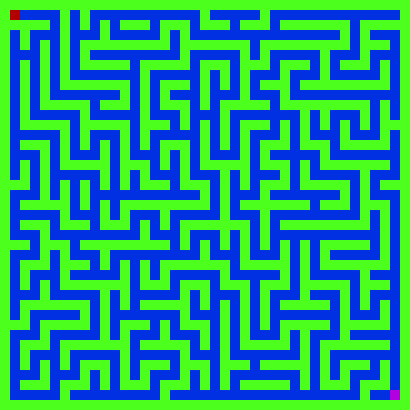
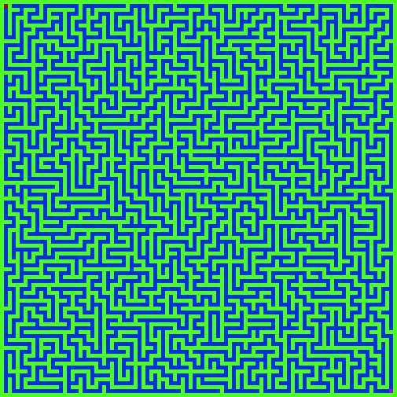

# Maze API
  High performance HTTP API for generating Mazes encoded as JPEG.  

# Features
  - Can handle thousands of maze generations per second
  - Uses query parameters to set parameters easilly without digging in HTTP Headers
  - Uses DJB2 for string seed for predictable mazes
  - Lightweight, only reliant on httplib and libjpeg
  - Turns off caching for instantly updating mazes

# Parameters
  The API uses query string for the maze parameters.
  `width` Width of maze grid
  `height` Height of maze grid
  `seed` Seed string 
  `scale` Amount of pixels in the final image per 1 grid cell
  `revisit` If present, 1 cell can be visited multiple times (imperfect mazes with loops and such)

# Running
## Docker
1) `docker build -t maze_api:latest .`
2) `docker run -it -d -p 8080:8080 maze_api`

## Without docker(unix)
0) Make sure you have libjpeg installed
1) `cmake -D CMAKE_BUILD_TYPE=Release -B ./build/Release -S .`
2) `cmake --build ./build/Release --config Release`
3) Run with: `./build/Release/maze_api_cpp`
4) Optional: Install with `cmake --install ./build/Release --prefix /usr/local/bin/ --verbose`
   Run with `/usr/local/bin/maze_api_cpp`
 
# Examples
`/?width=20&height=20&scale=10&seed=hello&revisit`  

`/?width=50&height=50&scale=5`  

